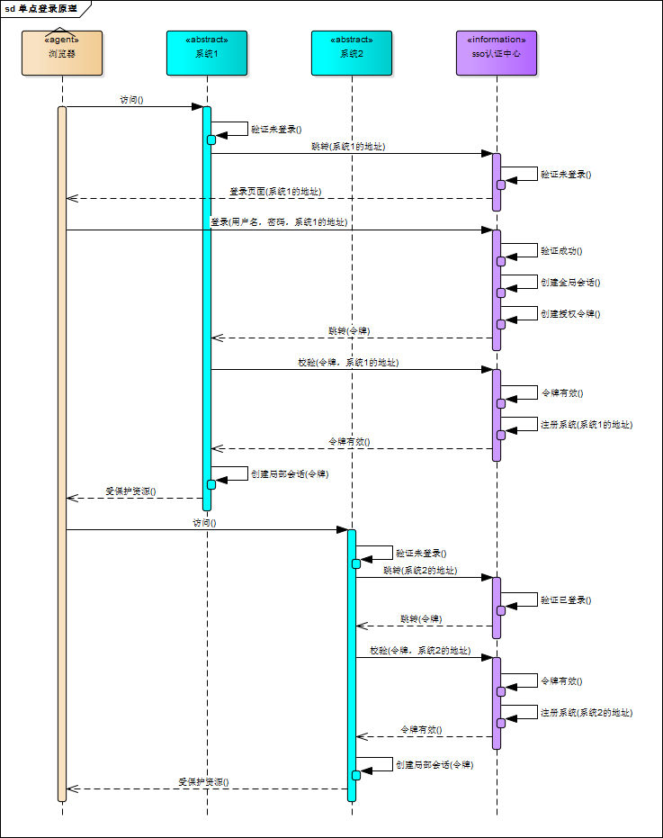
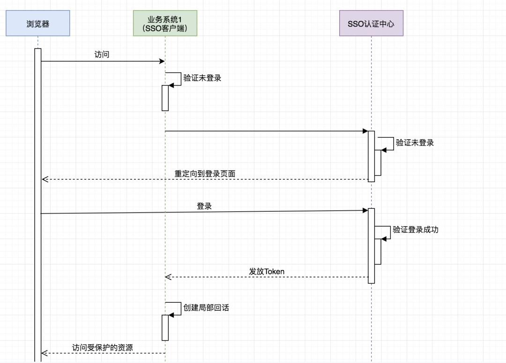

# 《基于Spring Security Oauth2的SSO单点登录+JWT权限控制实践》

## 名词解释
在此之前需要学习和了解一些前置知识包括：

- [**Spring Security**](https://spring.io/projects/spring-security)：基于 `Spring`实现的 `Web`系统的认证和权限模块
- [**OAuth2**](http://www.ruanyifeng.com/blog/2014/05/oauth_2_0.html)：一个关于授权（`authorization`）的开放网络标准
- **单点登录 (SSO)**：在多个应用系统中，用户只需要登录一次就可以访问所有相互信任的应用系统
- [**JWT**](https://jwt.io/)：在网络应用间传递信息的一种基于 `JSON`的开放标准（(`RFC 7519`)，用于作为`JSON`对象在不同系统之间进行安全地信息传输。主要使用场景一般是用来在 身份提供者和服务提供者间传递被认证的用户身份信息
---

## 要完成的目标

- 设计并实现一个第三方授权中心服务（`Server`），用于完成用户登录，认证和权限处理
- 可以在授权中心下挂载任意多个客户端应用（`Client`）
- 当用户访问客户端应用的安全页面时，会重定向到授权中心进行身份验证，认证完成后方可访问客户端应用的服务，且多个客户端应用只需要登录一次即可（谓之 “单点登录 `SSO`”）

基于此目标驱动，本文设计三个独立服务，分别是：
- 一个授权服务中心（`sso-server`）
- 客户端应用1（`sso-client-user`）
- 客户端应用2（`sso-client-order`）
---
 
## 验证步骤
- 启动授权认证中心 `sso-server`（启动于本地`8080`端口）
- 启动客户端应用 `sso-client-user` （启动于本地`8081`端口）
- 启动客户端应用 `sso-client-order` （启动于本地`8082`端口）

首先用浏览器访问客户端1 (`sso-client-user`) 的测试接口：`localhost:8081/user`，由于此时并没有过用户登录认证，因此会自动跳转到授权中心的登录认证页面：`http://localhost:8080/sso/login`，输入用户名 `wayne`，密码 `123456`，即可登录认证，并进入授权页面，
意授权后，会自动返回之前客户端的测试接口。
此时我们再继续访问客户端1 (`sso-client-user`) 的测试接口：`localhost:8081/medium`，发现已经直接可以调用而无需认证了。

由于 `localhost:8081/normal` 和 `localhost:8081/medium`要求的接口权限，用户`wayne`均具备，所以能顺利访问，接下来再访问一下更高权限的接口：`localhost:8081/admin`，返回403状态码，符合预期。

接下来访问外挂的客户端2 (`sso-client-order`) 的测试接口：`localhost:8082/order`，会发现此时会自动跳到授权页，授权完成之后就可以顺利访问客户端2 (`sso-client-order`) 的接口。

单点登录`SSO`验证成功。

---

## TODO
- 客户端 `client`凭据 和 用户 `user`的凭据可以用数据库进行统一管理
- 认证 `token`也可以用数据库或缓存进行统一管理
- 授权认证中心的统一登录页面可以自定义成需要的样子
- 认证中心的授权页也可以自定义，甚至可以去掉，自动授权
- 定制登录成功/失败处理器

### 流程图

